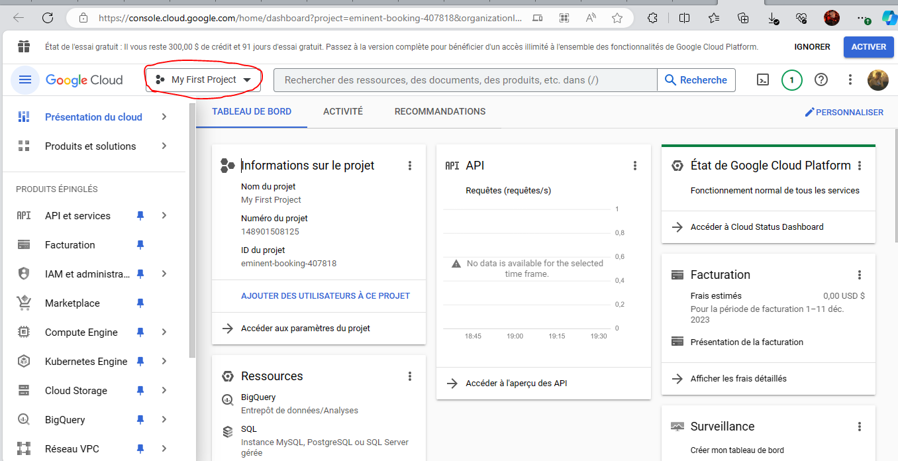
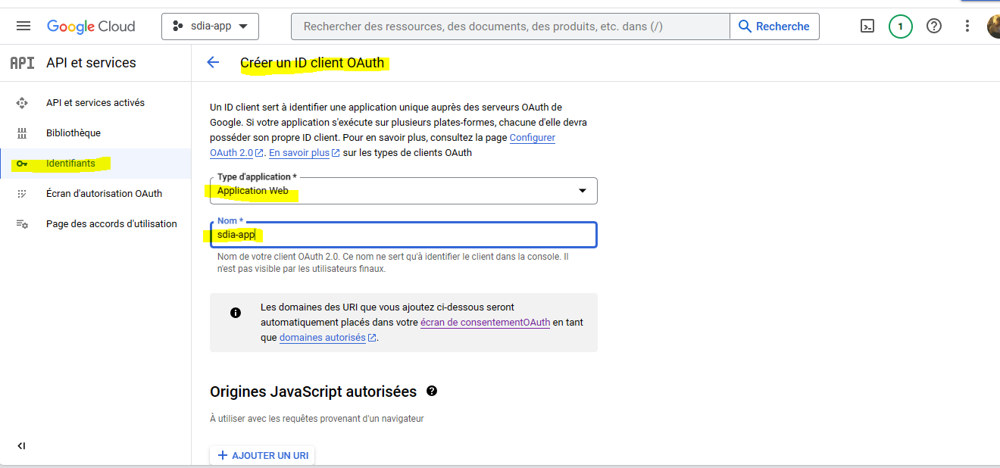

<h1>How to Secure Spring Boot and Angular Apps using Oauth 2 and OIDC Keycloak Google GitHub</h1>
<h5>Dependencies</h5>

<ul>
<li>Spring web</li>
<li>Lombok</li>
<li>Spring data jpa</li>
<li>oauth2 client</li>
<li>thymeleaf</li>
<li>h2 database</li>
<li>webjars bootstrap 5</li>
<li>thymeleaf layout</li>

**Thymeleaf:**
Thymeleaf is a Java-based server-side template engine commonly used in Spring applications. 
It enables the dynamic rendering of web pages by embedding expressions in HTML markup, 
facilitating the creation of dynamic and data-driven user interfaces.

**Thymeleaf Layout:**
Thymeleaf Layout is an extension for Thymeleaf that simplifies the creation of reusable layouts in web applications.
It allows developers to define standard templates (e.g., headers, footers) and dynamically inject content into these templates. 
This helps maintain a consistent look and feel across different pages, improving code organization 
and promoting reusability in the development of web applications.

</ul>
<h5>Security with google</h5>
<a href="https://cloud.google.com/cloud-console/">console google</a> (or)
<a href="https://console.cloud.google.com/home/dashboard?project=eminent-booking-407818&organizationId=0">console google</a>

configurer l'ecrane de ...

Add app name and your email (twice) --> save 

Take the client id and secret and add it to the application.properties
add SecurityConfig Class
take the url and put it in google console (authorized URI)

http://localhost:8081/login/oauth2/code/google

<h3>Logout</h3>
add the thymeleaf-extras dependency
<pre>
        <.dependency>
            <groupId>org.thymeleaf.extras</groupId>
            <artifactId>thymeleaf-extras-springsecurity6</artifactId>
            <version>3.1.0.M1</version>
        <./dependency>
</pre>

<h2>Github</h2>

go to github setting then developer setting -> auth apps and create new auth-app

<a href="https://github.com/settings/developers">developers</a>

<h2>Keycloak</h2>

when we create a client we need to fill this to use the client id and client secret

<h5>create roles and users </h5>

http://localhost:8081/login/oauth2/code/github

Keycloak test with HTTP request

<pre>
POST http://localhost:8080/realms/sdia-app-realm/protocol/openid-connect/token
Accept: application/json
Content-Type: application/x-www-form-urlencoded

grant_type=password&username=user1&password=user1&client_id=sdia-customers-app&client_secret=2gBa9DYZQ7kw9u0Ef9VTaDpLGvphUYff
</pre>

Get the client secret 

add roles for authentification (add roles in jwt)

click on the role realm that we added then

the roles are now in the jwt exactly in realm_access

<h5>Add 2 functions to the SecurityConfig</h5>

 
    public GrantedAuthoritiesMapper userAuthoritiesMapper() -----
    mapAuthorities

Add a not authorized page

Assign role to a user who authenticated, if we registered

Our new user (user3) has a USER role

<h6>Apply the security politics</h6>

<h2>Inventory Service</h2>

<h6>Test our security of the inventory service </h6>
<pre>
POST http://localhost:8080/realms/sdia-app-realm/protocol/openid-connect/token
Accept: application/json
Content-Type: application/x-www-form-urlencoded

grant_type=password&username=user1&password=user1&client_id=sdia-customers-app&client_secret=f65VK6o1ntoqXSYMmVKsdaUAbRPV5vxY

###

GET http://localhost:8082/products
Authorization: Bearer (access token =eyJhbGciOiJSUvbWVy..)

</pre>

<h2>Angular</h2>

1-Install angular with this command : <color style="color: yellowgreen">npm install @angular/cli</color>

2-Create a directory customer-front-angular-application

3-Create angular project with this command : <color style="color: yellowgreen">ng new customer-front-angular-application --directory ./ --no-standalone</color> , (--no-standalone) is for generate the module

Generate component (customers and products component) : <color style="color: yellowgreen">ng g c customers</color>

Install bootstrap : <color style="color: yellowgreen">npm i bootstrap bootstrap-icons</color>

Declare bootstrap in angular.json file, in style add : <color style="color: yellowgreen">"node_modules/bootstrap/dist/css/bootstrap.min.css"</color> , in script add : <color style="color: yellowgreen">"node_modules/bootstrap/dist/js/bootstrap.bundle.js"</color> 

Add <color style="color: burlywood">@import "bootstrap-icons/font/bootstrap-icons.min.css"</color> in style.css file

Modify the app.component.htm, customers/products.htm with some html codes

Add routes in app.routing.module.ts

Add HttpClientModule in app.module.ts (import) then the products and customers component to generate them

<h5>Create new Angular keycloak client</h5>

<h6>Authentification backend channel</h6>

Authentication in the backend channel will be implemented using a customized approach, 
distinct from the default Keycloak authentication form. 
(by another formular of authentification, not the keycloak formular)

But here we gonna use frontend channel, using the keycloak authentication formule

<h5>Keycloak activation in Angular</h5>
<a href="https://www.npmjs.com/package/keycloak-angular">get all you need about the keycloak-angular</a>

1- Install keycloak-angular and keycloak-js by : <color style="color: yellowgreen">npm install keycloak-angular keycloak-js</color>

2- Add factory function in the module which will set up the Keycloak service so that it can be used in the application.

Add realm and client id name

<pre>
function initializeKeycloak(keycloak: KeycloakService) {
  return () =>
    keycloak.init({
      config: {
        url: 'http://localhost:8080',
        realm: 'your-realm',
        clientId: 'your-client-id'
      },
      initOptions: {
        onLoad: 'check-sso',
        silentCheckSsoRedirectUri:
          window.location.origin + '/assets/silent-check-sso.html'
      }
    });
}
</pre>

3- Creat silent-check-sso.html file in assents directory and add on it : 

To apply the factory function(service) if we start the application, we add this provider in the module, and import KeycloakAngularModule(inclue the KeycloakService) in the imports

<pre>
{provide : APP_INITIALIZER, deps : [KeycloakService],useFactory : initializeKeycloak, multi : true}
</pre>
<h6>protect the routes by Guards</h6>
<ul>
<li>Generate guards in the directory guards</li>

<color style="color: yellowgreen">nvm use 20</color>

<color style="color: yellowgreen">ng g g guards/auth</color>

Modify the file auth.guards.ts, and protect the roles in routing.module file, add the role admin for products

</ul>
<h5>Display Use name</h5>
<h6>Generate services <color style="color: yellowgreen">ng g s services/security</color></h6>
<h6>App component <color style="color:cadetblue">Implement onInit</color></h6>
<h6>Use the service to display the username, in component.html</h6>
<h6>Create the login and logout methods</h6>

<h3>With Docker</h3>

